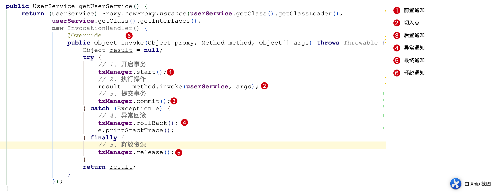

## 五、Spring AOP
#### 5.1 相关术语
1. 连接点 Joinpoint
> 被拦截到的点；spring中指方法，因为spring只支持方法的拦截
2. 切入点 Pointcut
> 进行了增强的连接点
3. 通知 Advice
> 在切入点进行的所有增强的操作
> 通知的类型：前置通知，后置通知，异常通知，最终通知，环绕通知
> 

1. 切面 Aspect
> 切入点和通知的结合
5. 目标对象 Target
> 被代理的对象
5. 代理对象 Proxy
> 增强后的对象
6. 织入 Weaving
> 把切面应用到目标对象产生增强后的代理对象的过程
> 注意：spring采用动态代理织入，而AspectJ采用编译器织入和类装载期织入
7. 引入

#### 5.2 xml配置实现spring aop
1. xml配置步骤
> 1. 使用<aop:config>标签开始spring aop的配置
> 2. 使用<aop:aspect>标签开始配置切面
>> - id: 切面ID
>> - ref: 切面处理Bean
> 3. 使用<aop:aspect>等子标签配置通知类型
>> - method: 通知处理的具体方法
>> - pointcut: 切入点表达式，用于描述哪些连接点可以作为切入点
> 4. 切入点表达式
>> - 关键字：execution
>> - 表达式：访问修饰符 返回值 类限定名.方法名(参数列表)
>> - 标准写法：public void com.lizza.service.UserService.update(int)
>> - 访问修饰符可以省略：void com.lizza.service.UserService.update(int)
>> - 返回值可以使用通配符：* com.lizza.service.UserService.update(int)
>> - 包名可以使用通配符，有几级包写几个*：* *.*.*.UserService.update(int)
>> - 包名使用..表示当前包及其子包：* com.lizza..update(int)
>> - 类名和方法名都可以使用通配符：* com.lizza..*()
>> - 参数列表：* com.lizza..*(..)
>>> - 基本类型：直接写名称，如int，char，double
>>> - 应用类型：全限定名.类名，如：java.lang.String
>>> - *：表示必须有参数
>>> - ..：表示有无参数均可
>>> - 全通配形式：* *..*.*(..)

- beans.xml
```
<beans xmlns="http://www.springframework.org/schema/beans"
       xmlns:xsi="http://www.w3.org/2001/XMLSchema-instance"
       xmlns:aop="http://www.springframework.org/schema/aop"
       xsi:schemaLocation="http://www.springframework.org/schema/beans
        https://www.springframework.org/schema/beans/spring-beans.xsd
        http://www.springframework.org/schema/aop
        https://www.springframework.org/schema/aop/spring-aop.xsd">

    <bean id="userService" class="com.lizza.service.UserService"></bean>

    <bean id="log" class="com.lizza.util.Log"></bean>

    <!--
        Spring中配置AOP的步骤
        1. 使用<aop:config>标签开始spring aop的配置
        2. 使用<aop:aspect>标签开始配置切面
            id: 切面ID
            ref: 切面处理Bean
        3. 使用<aop:aspect>等子标签配置通知类型
            method: 通知处理的具体方法
            pointcut: 切入点表达式，用于描述哪些连接点可以作为切入点
        4. 切入点表达式
            关键字：execution
            表达式：访问修饰符 返回值 类限定名.方法名(参数列表)
            标准写法：public void com.lizza.service.UserService.update(int)
            访问修饰符可以省略：void com.lizza.service.UserService.update(int)
            返回值可以使用通配符：* com.lizza.service.UserService.update(int)
            包名可以使用通配符，有几级包写几个*：* *.*.*.UserService.update(int)
            包名使用..表示当前包及其子包：* com.lizza..update(int)
            类名和方法名都可以使用通配符：* com.lizza..*()
            参数列表：* com.lizza..*(..)
                基本类型：直接写名称，如int，char，double
                应用类型：全限定名.类名，如：java.lang.String
                *：表示必须有参数
                ..：表示有无参数均可
            全通配形式：* *..*.*(..)
    -->
    
    <aop:config>
        <aop:aspect id="logAdvice" ref="log">
            <aop:before method="log" pointcut="execution(* com.lizza..*())"></aop:before>
        </aop:aspect>
    </aop:config>
</beans>
```

> 源码地址：[https://github.com/KJGManGlory/spring-framework](https://github.com/KJGManGlory/spring-framework)
